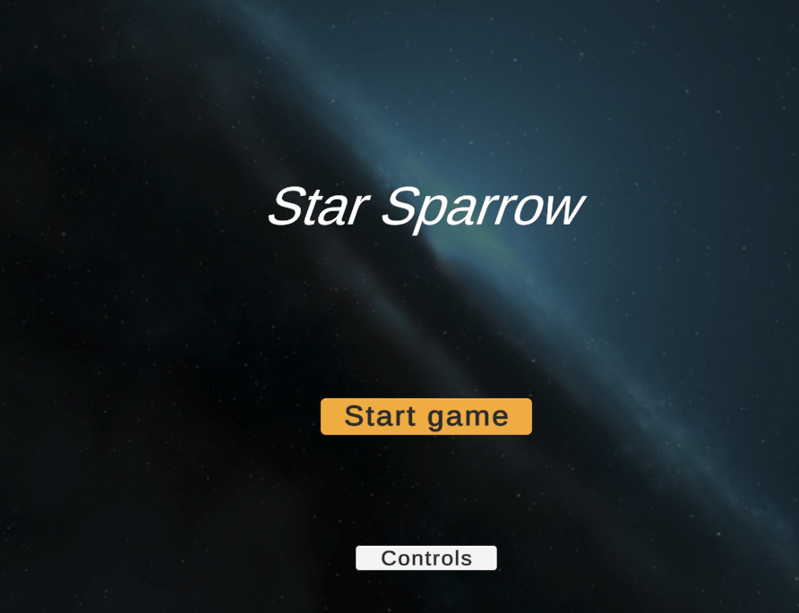
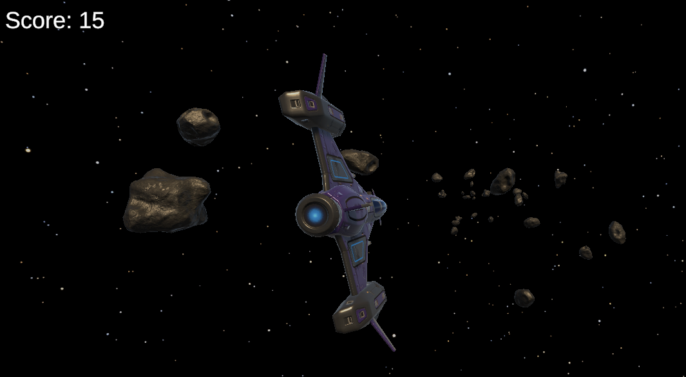

# PWS-Game-muziek-en-concentratie-onderzoek

## Endless runner gemaakt met unity-engine en C#.
Doel: simpele game opstellen met genoeg functionaliteit om onderzoek te doen naar effect van muziek op games.

-Endless 'flyer' met spaceship dat rond vliegt en asteroïden ontwijkt.

-Stats logger functionaliteit om verschillende statistieken van spelers bij te houden

## Controls

## In-game images

### TODO:
- ~~Obstacles toevoegen~~

- ~~Add game difficulty scaler~~ (kinda)

- Muziek handler voor eigen tracks

- ~~Player dodge functie implementeren~~

- ~~Score tracker implementeren~~ (also kinda)

- (mogelijk? -- Python script schrijven dat gelogde stats visualiseert)
